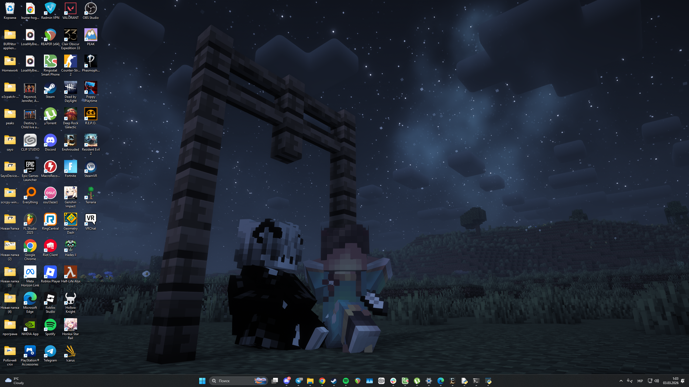
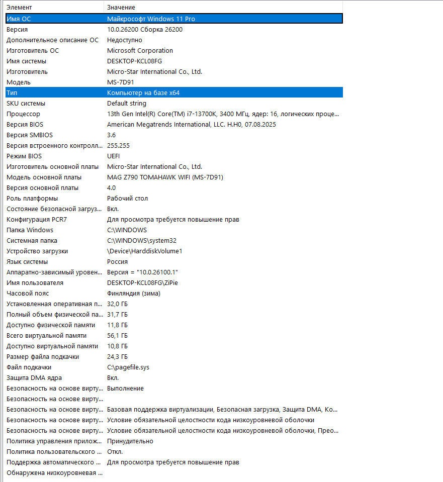
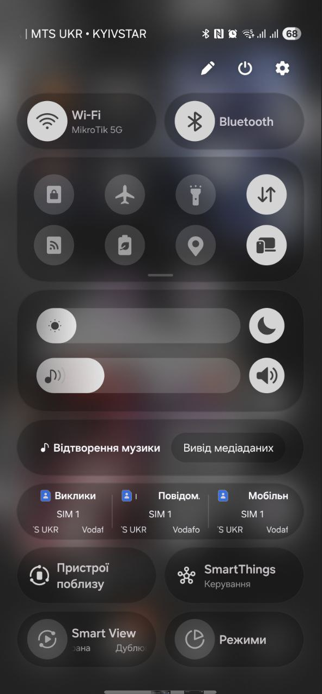
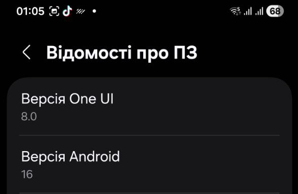

# Самостійна робота
**Виконав студент групи РПЗ-33 Тихий Андрій**

## Порівняльна характеристика операційних систем (Windows та Android)

Для порівняння обрано ОС Windows 11 та мобільну ОС Android із фірмовою оболонкою One UI (Samsung Galaxy S24 Ultra).

| Критерій порівняння | Windows 11 (ПК / Ноутбук) | Android (Samsung Galaxy S24 Ultra) |
| :--- | :--- | :--- |
| **Архітектура ядра ОС** | **Гібридне ядро (Windows NT).** Поєднує риси монолітного ядра та мікроядра. Основні системні служби та драйвери працюють у просторі ядра для максимальної швидкості, але архітектура дозволяє завантажувати сторонні драйвери як модулі. | **Монолітне ядро (модифіковане ядро Linux).** Усі базові служби (робота з пам'яттю, процесором, драйвери) працюють у єдиному просторі ядра. Має глибокі модифікації для мобільних пристроїв, зокрема агресивне управління живленням (Wakelocks) та пам'яттю (OOM Killer). |
| **Інтерфейс користувача** | **Багатовіконний GUI (Graphical User Interface).** Оптимізований для точного управління мишею та клавіатурою. Основні елементи: робочий стіл, панель завдань, меню «Пуск». Також має потужні вбудовані інтерфейси командного рядка (CLI) — PowerShell та Command Prompt. | **Сенсорний інтерфейс (Touch UI).** Оптимізований для управління пальцями та жестами (свайпи, щипки). У випадку Samsung використовується оболонка One UI поверх базового Android. Доступ до CLI (терміналу) за замовчуванням прихований для звичайного користувача. |
| **Системні виклики (System Calls)** | **Реалізуються через підсистему Win32 API / NTAPI.** Додатки не звертаються до ядра напряму. Вони викликають функції API, які через таблицю диспетчеризації системних служб (SSDT) генерують програмні переривання (в x64 архітектурі використовується інструкція `syscall`) для переходу в режим ядра. | **Базуються на стандартах POSIX.** Використовуються класичні системні виклики Linux. Однак додатки зазвичай звертаються до них не напряму, а через **Android Framework** (Java API). Замість стандартної бібліотеки `glibc` використовується оптимізована для мобільних пристроїв бібліотека `Bionic` (через інструкцію `svc` на ARM-процесорах). |

**1. Операційна система ПК (Windows 11)**
*Інтерфейс користувача (GUI) та інформація про систему:*

**2. Мобільна операційна система (Android / One UI)**
*Сенсорний інтерфейс користувача та інформація про версію ядра:*

