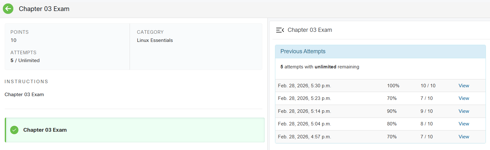
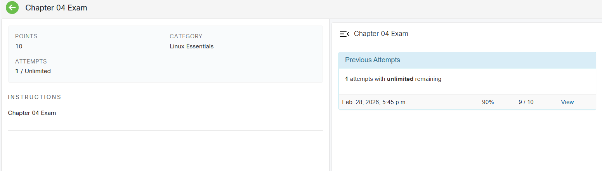
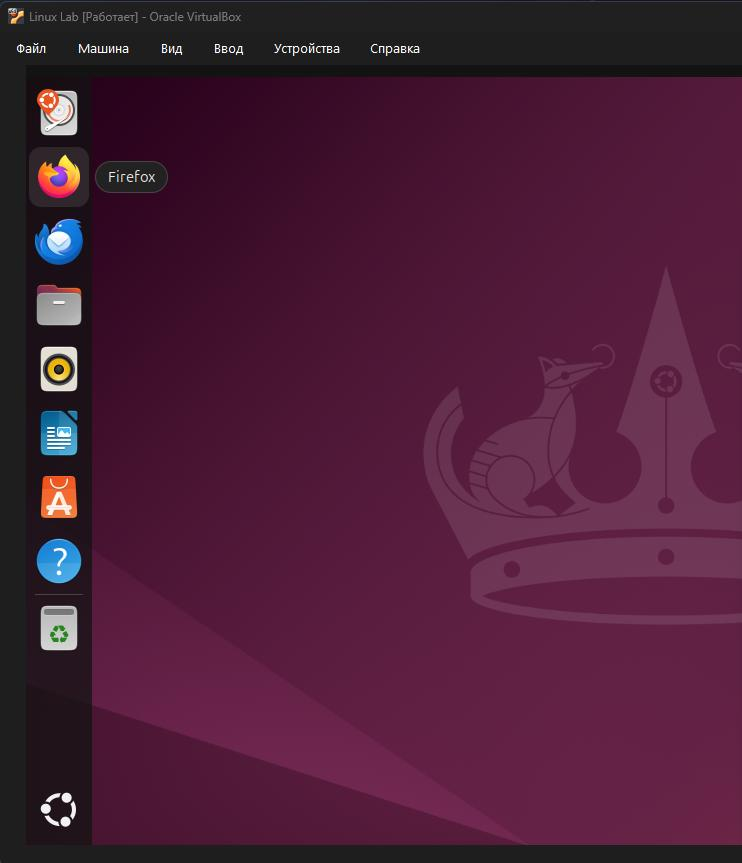
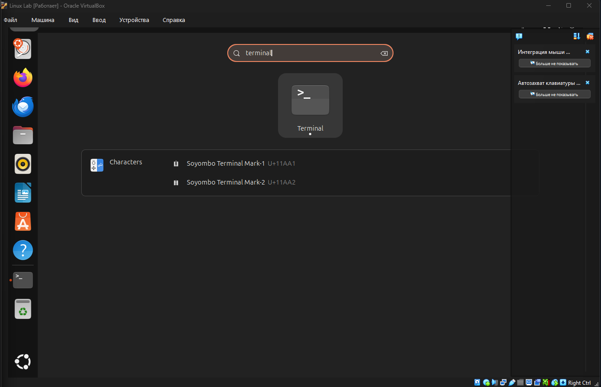
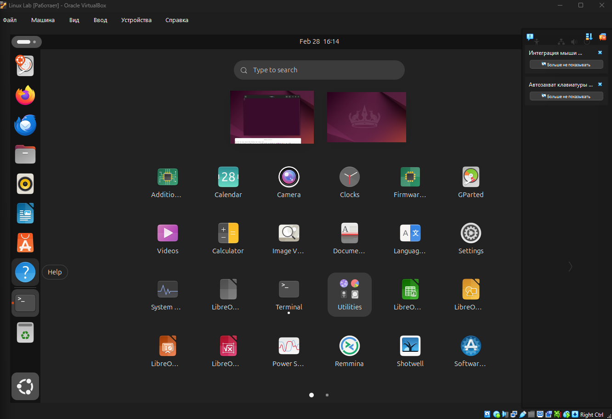
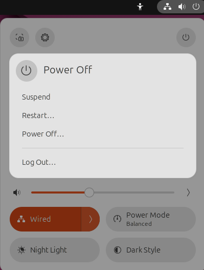

**Лабораторна** **робота** **№2** **Дисципліна:** **Операційні**
**системи** **1**

> **Тема:** **“Знайомство** **з** **інтерфейсом** **та**
> **можливостями** **ОС** **Linux”**

**Мета** **роботи:**

> 1\. Знайомство з інтерфейсами ОС Linux.
>
> 2\. Отримання практичних навиків роботи в середовищах ОС Linux та
> мобільної ОС – їх графічною оболонкою, входом і виходом з системи,
> ознайомлення зі структурою робочого столу, вивчення основних дій та
> налаштувань при роботі в системі

**Завдання** **для** **попередньої** **підготовки.**

Словник базових англійських термінів:

CLI (Command Line Interface) – інтерфейс командного рядка.

GUI (Graphical User Interface) – графічний інтерфейс користувача.

Kernel – ядро операційної системи (керує ресурсами).

Application (App) – прикладний додаток / програма.

Terminal / Console – термінал / консоль (середовище для вводу команд).

Process – процес (завдання, що завантажене і відстежується ядром).

Multitasking – багатозадачність (перемикання ядра між процесами).

Root – суперкористувач (адміністратор) в ОС Linux.

Визначення понять:

CLI-режим: Це система введення тексту для управління комп'ютером, де
користувач взаємодіє з операційною системою виключно шляхом набору
текстових команд (від окремих слів до складних скриптів) без
використання графічних елементів (вікон, кнопок).

Термінал на основі графічного інтерфейсу (GUI-terminal): Це програма
(емулятор термінала), яка запускається всередині графічного середовища
(наприклад, вікно GNOME Terminal). Вона емулює роботу командного рядка,
дозволяючи вводити команди, залишаючись у віконному інтерфейсі.

Віртуальний термінал (Virtual terminal / TTY): Це повноекранний
текстовий інтерфейс, який працює паралельно з графічною оболонкою (або
замість неї). Вимагає окремої авторизації користувача (логін та пароль)
перед початком введення команд.

**Лабораторна** **робота** **№2** **Дисципліна:** **Операційні**
**системи** **2**

**Основні** **позиції** **ходу** **роботи**

1\. Робота в графічному режимі в ОС сімейства Linux (на прикладі GNOME)

Для виконання роботи обрано графічну оболонку GNOME, яка є стандартною
для багатьох популярних дистрибутивів (наприклад, Ubuntu, Fedora).

Основне меню (Діяльності / Activities): Це центральний елемент
управління в GNOME. Викликається кнопкою у лівому верхньому куті екрана
або натисканням клавіші Super (Windows). У цьому режимі екран
затемнюється, і користувач бачить мініатюри всіх відкритих вікон, панель
завдань та рядок пошуку.

Панелі швидкого доступу (Dash / Dock): Розташована зазвичай зліва або
внизу екрана (залежить від налаштувань). На ній закріплені обрані
додатки (браузер, файловий менеджер, термінал) та відображаються іконки
запущених на даний момент програм.

Пошук: Інтегрований у меню «Діяльності». Знаходиться по центру вгорі.
Дозволяє миттєво знаходити встановлені програми, файли, налаштування
системи або виконувати прості обчислення.

Доступдо нових робочих столів(Workspaces): Робочі столи вGNOME
створюютьсядинамічно. Панель робочих столів знаходиться праворуч у
режимі «Діяльності». Якщо перетягнути вікно на порожній простір нижче
існуючого робочого столу, автоматично створиться новий.**Примітка:**
Якщо ви обрали інший графічний інтерфейс то компоненти меню можуть бути
іншими.

2\. Запуск програм

У середовищі GNOME запуск додатків можна здійснити кількома способами:

Через панельшвидкого запуску (Dash):Достатньо клікнути
лівоюкнопкоюмишіна іконку закріпленого додатка (наприклад, Firefox) на
панелі.

**Лабораторна** **робота** **№2** **Дисципліна:** **Операційні**
**системи** **3**

Запуск програм через пошук: Натискаємо клавішу Super, починаємо вводити
назву програми (наприклад, "terminal” для терміналу) і натискаємо Enter
на знайденому результаті.

**Лабораторна** **робота** **№2** **Дисципліна:** **Операційні**
**системи** **4**

Запуск програм через віджет запуску (Меню додатків): Натискаємо на
іконку з дев'ятьма крапками («Показати програми») внизу панелі Dash.
Відкривається сітка з усіма встановленими в системі додатками, звідки їх
можна запустити кліком.

**Лабораторна** **робота** **№2** **Дисципліна:** **Операційні**
**системи** **5**

3\. Вихід з системи та завершення роботи в Linux

Управління живленням та сеансами користувачів у GNOME здійснюється через
системне меню (System Menu), яке розташоване у правому верхньому куті
екрана (там, де індикатори мережі, звуку та батареї).

Зміна користувача на root: Примітка: у сучасних графічних оболонках
(як-от в Ubuntu) прямий графічний вхід під користувачем root
заблокований з міркувань безпеки. Зміна користувача виконується через
системне меню -\> Вийти / Змінити користувача (Switch User). Для
виконання адміністративних дій в графічному інтерфейсі використовується
sudo (система запитає пароль користувача), або підвищення привілеїв у
Терміналі командою su -.

Перезавантаження (Restart) та Вимкнення системи (Power Off):
Здійснюється через те ж системне меню. При натисканні на кнопку живлення
(Power) з'являється діалогове вікно з вибором дій: перезавантажити
комп'ютер або повністю його вимкнути.

**Лабораторна** **робота** **№2** **Дисципліна:** **Операційні**
**системи** **6**

**Відповіді** **на** **контрольні** **запитання**

> 1\. Наведіть приклади серверних додатків Linux для сервера баз даних,
> серверів розсилки повідомлень та файлообмінників.
>
> Бази даних: MySQL, PostgreSQL, MariaDB.
>
> Сервери розсилки повідомлень (Пошта): Postfix, Sendmail, Exim.
>
> Файлообмінники: Samba (SMB/CIFS), vsftpd (FTP), NFS.
>
> 2\. Порівняйте оболонки Bourne, C, Bourne Again (Bash), the tcsh, Korn
> shell (Ksh) та zsh.
>
> Bourne shell (sh): Історично перша популярна оболонка. Базова,
> використовується для написання скриптів завдяки високій сумісності,
> але має мінімум зручностей для користувача.
>
> C shell (csh / tcsh): Синтаксис схожий на мову програмування C. tcsh -
> це покращена версія csh з автодоповненням. Менш популярна для скриптів
> сьогодні.
>
> Bourne Again shell (bash): Стандартна оболонка для більшості
> дистрибутивів Linux. Поєднує найкраще з sh, csh та ksh. Підтримує
> історію команд, автодоповнення.
>
> Korn shell (ksh): Розроблена для сумісності з Bourne shell, але з
> додаванням багатьох зручних функцій з C shell. Дуже потужна для
> скриптингу.
>
> zsh: Дуже сучасна та потужна оболонка, що розширює можливості bash.
> Має найкращу систему автодоповнення, перевірку орфографії та величезну
> кількість плагінів (наприклад, фреймворк Oh My Zsh).
>
> 3\. Для чого потрібен менеджер пакетів. Які менеджери пакетів ви
> знаєте у Linux?
>
> Це набір програмного забезпечення, що автоматизує процеси
> встановлення, оновлення, налаштування та видалення програм в ОС. Він
> автоматично вирішує проблеми із залежностями бібліотек. Приклади: APT
> (в Debian/Ubuntu), YUM / DNF (в CentOS/Fedora), Pacman (в Arch Linux).
>
> 4\. \*Які засоби безпеки використовуються в Linux?
>
> Надійна система прав доступу до файлів (rwx) для власника, групи та
> інших; системи примусового контролюдоступу (SELinux або
> AppArmor);міжмережевіекрани(iptables/nftables/ufw);автентифікація

**Лабораторна** **робота** **№2** **Дисципліна:** **Операційні**
**системи** **7**

> через PAM; шифрування дисків (LUKS); використання SSH для віддаленого
> доступу.
>
> 5\. \*Чому використання віртуалізації зараз стало таким актуальним?
>
> Дозволяє на одному фізичному сервері запускати десятки ізольованих
> операційних систем. Це економить гроші на обладнанні, електроенергії,
> спрощує резервне копіювання, міграцію серверів та тестування ПЗ.
>
> 6\. \*Як ви розумієте поняття контейнеризації?
>
> Це легковажна альтернатива віртуалізації машин. Замість емуляції
> всього "заліза" та запуску окремого ядра ОС, контейнеризація
> (наприклад, Docker) ізолює додатки на рівні процесів, використовуючи
> єдине ядро хост-системи. Контейнери запускаються миттєво і споживають
> мінімум ресурсів.
>
> 7\. \*Які переваги/недоліки використання програмного забезпечення з
> відкритим кодом?
>
> Переваги: Безкоштовність, прозорість (можна перевірити на наявність
> закладок), швидке виправлення помилок спільнотою, відсутність
> прив'язки до одного вендора (vendor lock-in), висока гнучкість
> налаштувань.
>
> Недоліки: Часто відсутня офіційна технічна підтримка (або вона
> платна), складніше освоєння для звичайних користувачів, проблеми із
> сумісністю специфічного пропрієтарного обладнання (через закриті
> драйвери).
>
> 8\. \*\*Скільки активних віртуальних консолей (терміналів) може бути у
> процесі роботи Linux по замовчуванню. Як їх викликати та між ними
> перемикатися? Наведіть приклади?
>
> За замовчуванням у більшості дистрибутивів Linux доступно 6 активних
> віртуальних консолей (tty1 -tty6). Перемикання між ними здійснюється
> комбінацією клавіш Ctrl + Alt + F1 ... Ctrl + Alt + F6.
>
> 9\. \*\*Яка віртуальна консоль (термінал) виконує функцію графічної
> оболонки?
>
> Зазвичай графічна оболонка (X Server або Wayland) запускається на 1-й
> (tty1) або 7-й (tty7) віртуальній консолі (залежить від дистрибутиву
> та версії системи). Відповідно, повернутися в графіку можна
> комбінацією Ctrl + Alt + F1 або Ctrl + Alt + F7.
>
> 10\. \*\*Чи можлива реєстрація в системі Linux декілька разів під
> одним і тим же системним ім’ям? Які переваги це може надати?
>
> Так, у Linux можлива багаторазова реєстрація під одним іменем як на
> різних віртуальних терміналах, так і через віддалені підключення
> (SSH). Переваги: Дозволяє одночасно виконувати різні ізольовані
> завдання; один процес може довго компілюватися в одному терміналі,
> поки користувач працює з файлами в іншому; зручність адміністрування.

**Висновки:**

У ході виконання лабораторної роботи було успішно здійснено знайомство з
базовими концепціями ОС сімейства Linux. Було вивчено відмінності між
інтерфейсом командного рядка (CLI) та графічним інтерфейсом користувача
(GUI). Практично досліджено структуру робочого столу на прикладі
графічної оболонки (GNOME), освоєно базовідії звікнами, запуском програм
та управлінням живленням системи. Також проведено аналогію між
архітектурою десктопних дистрибутивів Linux та мобільною ОС (Android),
проаналізовано їх підходи до управління ресурсами та процесами. Отримані
знання є фундаментальними для подальшого адміністрування та використання
UNIX-подібних операційних систем.
